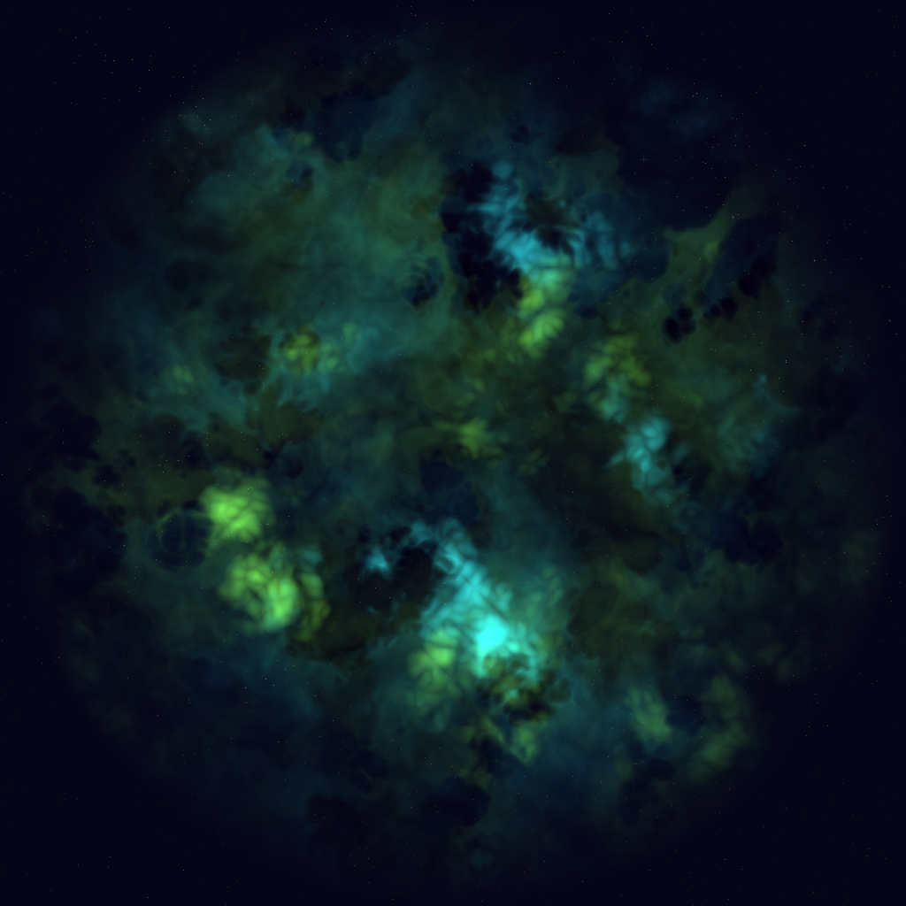

# Procedural Nebulae

This is an experiment at producing procedural nebulae, intended to feature as the backdrop in a game I am working on.

The basic approach is based on the method described by [Takumi], adapted to run in Rust (and on the CPU rather than a shader), and for the finishing touches I added "Billow" Simplex noise for the bright and dark spots, then alpha-blend multiple layers with different base colors together.

## Using this crate

This is meant to be used as a lib crate, though currently it also provides a bin as well; you can therefore simply `cargo run` this crate, and it will replace the `nebula.png` file with a new one.

## MSRV

I make no assertions that this crate works under any version of Rust other than whatever the current stable is the last time I ran it.

## License

Licensed under either of

 * Apache License, Version 2.0, ([LICENSE-APACHE](LICENSE-APACHE) or
   http://www.apache.org/licenses/LICENSE-2.0)
 * MIT license ([LICENSE-MIT](LICENSE-MIT) or http://opensource.org/licenses/MIT)

at your option.

### Contribution

Unless you explicitly state otherwise, any contribution intentionally submitted
for inclusion in the work by you, as defined in the Apache-2.0 license, shall be dual licensed as
above, without any additional terms or conditions.

[Takumi]: https://www.codementor.io/@tlhm/procedural-generation-visual-rendering-unity3d-du107jjmr